# 🏗️ Taiga MCP Server - 架构图和流程图

## 📋 架构概览

### 系统整体架构图

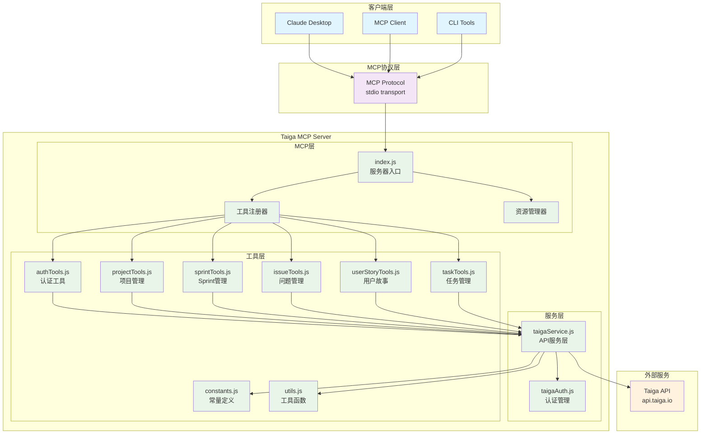

### 模块依赖关系图

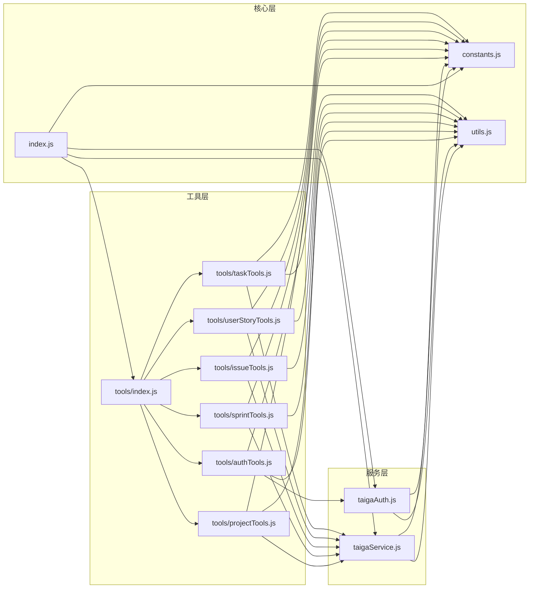

## 🔄 核心流程图

### 1. MCP服务器启动流程

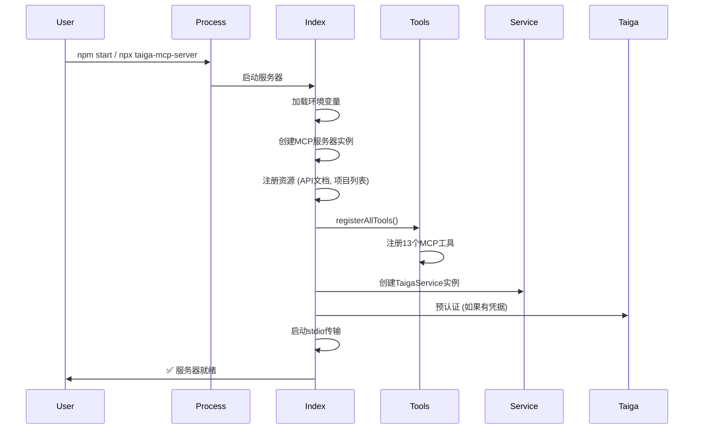

### 2. 工具调用流程

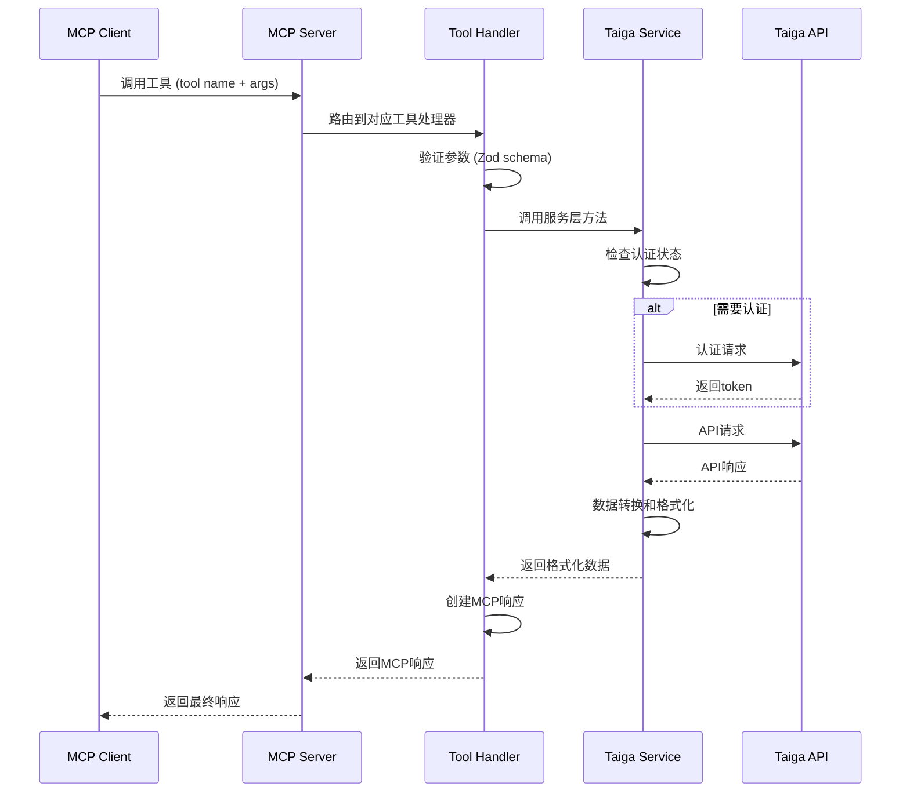

### 3. 认证流程

```mermaid
sequenceDiagram
    participant User
    participant Auth as authTools
    participant Service as taigaAuth
    participant API as Taiga API
    
    User->>Auth: authenticate(username, password)
    Auth->>Service: authenticate()
    Service->>API: POST /auth
    alt 认证成功
        API-->>Service: 返回 auth_token
        Service->>Service: 存储token到内存
        Service-->>Auth: 认证成功
        Auth-->>User: ✅ 认证成功消息
    else 认证失败
        API-->>Service: 401 错误
        Service-->>Auth: 认证失败错误
        Auth-->>User: ❌ 认证失败消息
    end
```

### 4. 项目解析流程

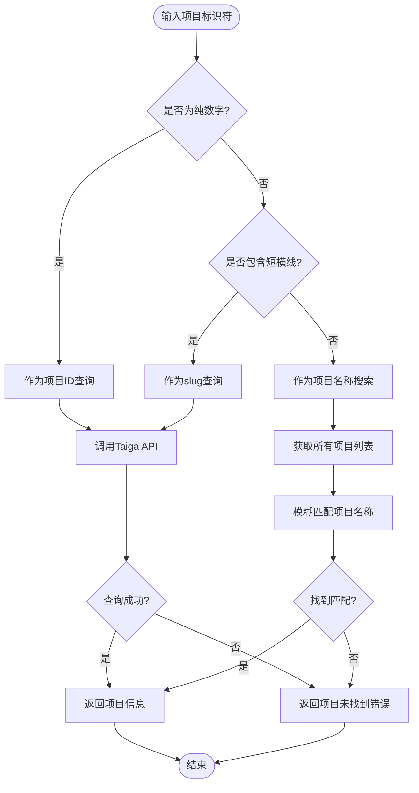

## 🧪 测试架构流程

### 测试执行流程

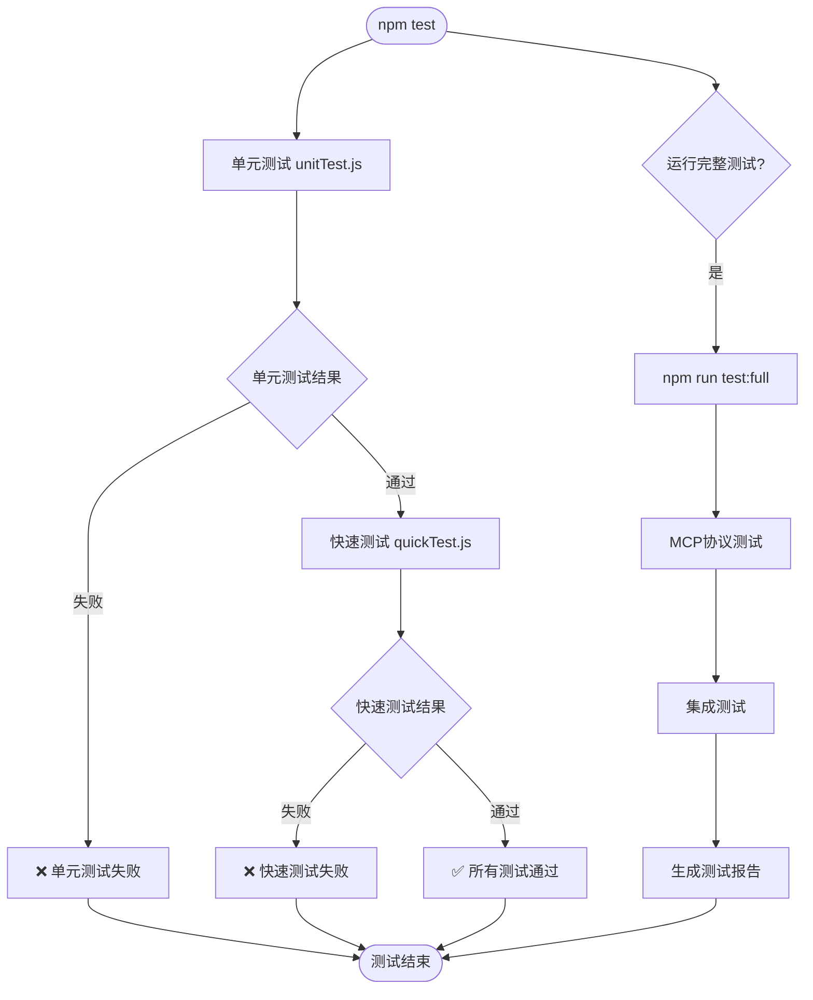

### 测试层级关系

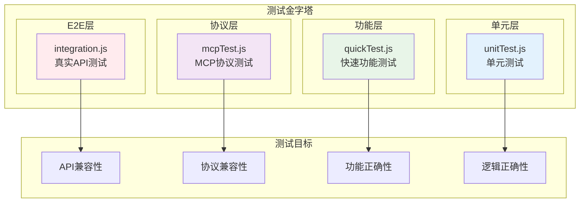

## 🚀 部署架构

### NPM包分发架构

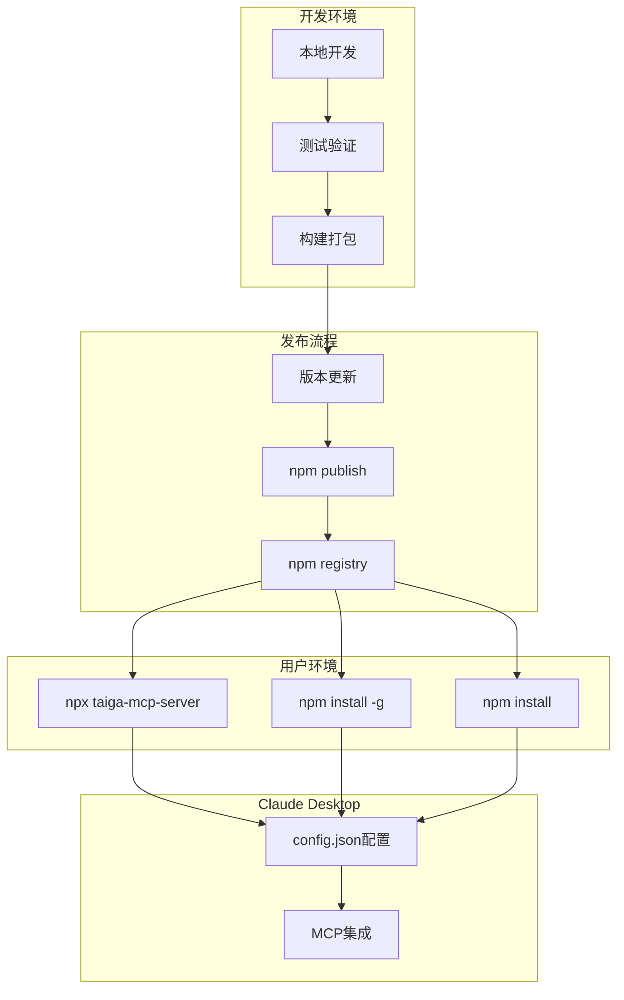

### Docker容器化架构 (规划中)

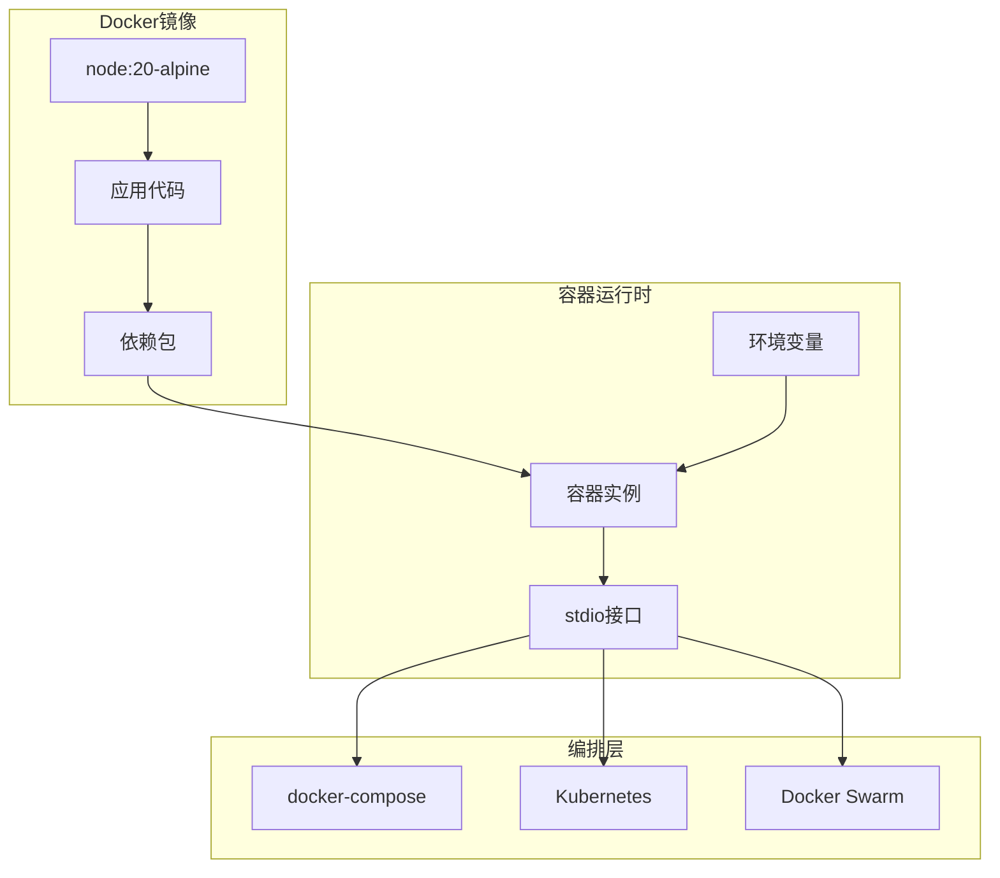

## 📊 数据流架构

### 请求-响应数据流

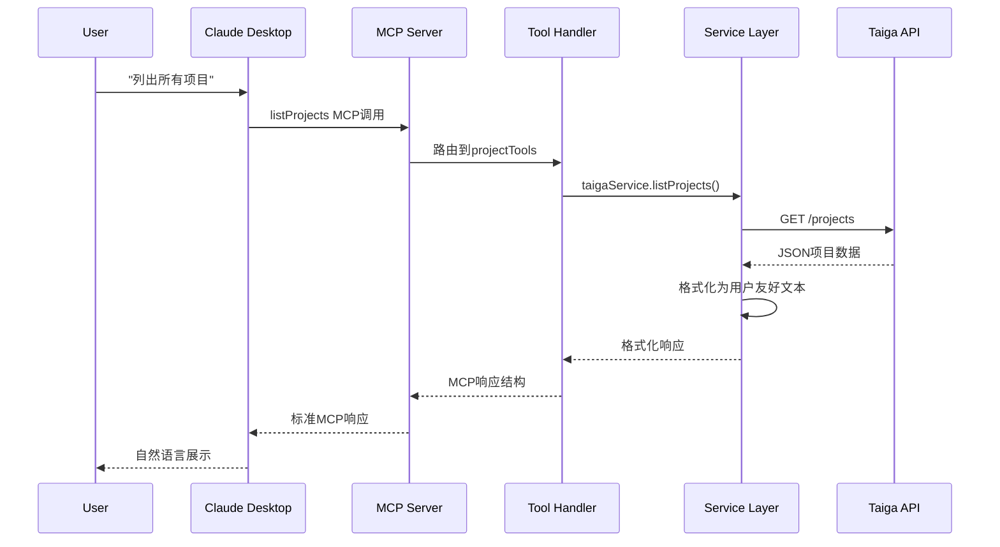

### 错误处理流程

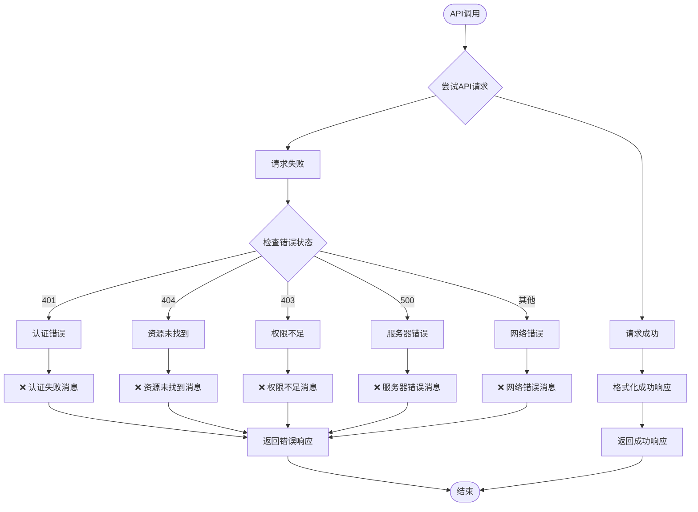

## 🔧 扩展架构

### 工具扩展流程

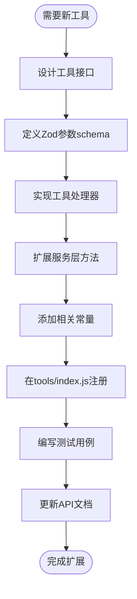

### 性能优化架构

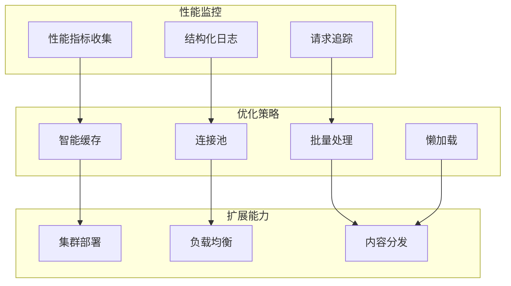

---

这些架构图和流程图提供了Taiga MCP Server的完整技术视图，帮助开发者理解系统设计思路和实现细节，为后续的维护和扩展提供清晰的指导。