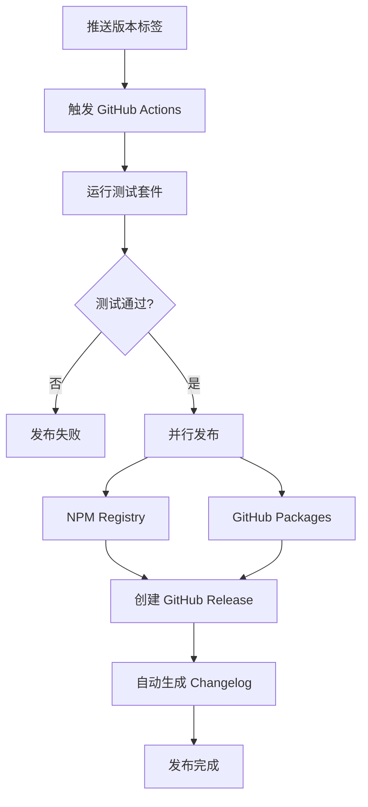

# 🚀 CI/CD 自动化指南

完整的 GitHub Actions 自动化发布流程，实现从代码推送到多平台发布的全流程自动化。

## 📋 自动化概览

### 工作流程图



### 核心特性

- ⚡ **快速发布**: 总耗时 ~45秒
- 🔄 **双重发布**: NPM + GitHub Package Registry
- 🧪 **质量保证**: 100% 测试通过要求
- 📝 **自动文档**: Release Notes 和 Changelog 生成
- 🛡️ **安全发布**: 权限隔离和 Secret 管理

## 🏗️ 工作流架构

### Job 依赖关系

```
🧪 测试阶段 (Test)
    ↓
📦 并行发布阶段
    ├── NPM 发布 (Publish)
    └── GPR 发布 (Publish-GPR)
    ↓
🎉 Release 创建 (Create-Release)
```

### 详细步骤

| 阶段 | 时长 | 操作 |
|------|------|------|
| 🧪 测试 | ~10s | 单元测试 + 快速测试 |
| 📦 NPM 发布 | ~12s | 发布到 npmjs.org |
| 📦 GPR 发布 | ~13s | 发布到 GitHub Packages |
| 🎉 Release | ~8s | 创建 GitHub Release |

## ⚙️ 配置要求

### 1. GitHub Repository Secrets

在 `Settings → Secrets and variables → Actions` 中配置：

| Secret 名称 | 类型 | 用途 | 获取方式 |
|-------------|------|------|----------|
| `NPM_TOKEN` | 自动化令牌 | NPM 发布认证 | [npmjs.com](https://www.npmjs.com) → Access Tokens → Automation |

### 2. NPM Token 生成步骤

1. **登录 NPM**:
   ```bash
   npm login
   ```

2. **创建自动化 Token**:
   - 访问 [npmjs.com/settings/tokens](https://www.npmjs.com/settings/tokens)
   - 点击 "Generate New Token"
   - 选择 "Automation" 类型
   - 复制生成的 token

3. **配置 GitHub Secret**:
   - 仓库 → Settings → Secrets and variables → Actions
   - 点击 "New repository secret"
   - Name: `NPM_TOKEN`
   - Secret: 粘贴 NPM token

### 3. 权限配置

工作流自动获得以下权限：
- `contents: write` - 创建 Release
- `packages: write` - 发布到 GitHub Packages
- `pull-requests: read` - 生成 Release Notes

## 🎯 发布流程

### 自动发布 (推荐)

```bash
# 1. 创建新版本
npm version patch    # 1.5.6 → 1.5.7 (补丁)
npm version minor    # 1.5.6 → 1.6.0 (功能)
npm version major    # 1.5.6 → 2.0.0 (重大更新)

# 2. 推送触发自动化
git push origin main --tags

# 3. 等待自动化完成 (~45秒)
```

### 手动触发 (备用)

```bash
# 创建标签
git tag -a v1.5.7 -m "Release v1.5.7"

# 推送标签
git push origin v1.5.7
```

### 验证发布

```bash
# 检查 NPM 版本
npm view taiga-mcp-server version

# 检查 GitHub Release
gh release view --web

# 查看 Actions 状态
gh run list --limit 1
```

## 📦 双重发布详情

### NPM Registry 发布

**目标**: https://registry.npmjs.org/  
**包名**: `taiga-mcp-server`  
**安装**:
```bash
npm install taiga-mcp-server
npx taiga-mcp-server
```

**特点**:
- ✅ 官方 npm 注册表
- ✅ 全球 CDN 加速
- ✅ 版本管理和统计

### GitHub Package Registry 发布

**目标**: https://npm.pkg.github.com/  
**包名**: `@greddy7574/taiga-mcp-server`  
**安装**:
```bash
npm install @greddy7574/taiga-mcp-server
npx @greddy7574/taiga-mcp-server
```

**特点**:
- ✅ 与仓库集成
- ✅ 企业友好
- ✅ 自动认证

### 包名处理

工作流自动处理包名转换：
```javascript
// 原始 package.json
"name": "taiga-mcp-server"

// GPR 发布时自动转换为
"name": "@greddy7574/taiga-mcp-server"
```

## 📝 Release Notes 自动生成

### 生成内容

每个 Release 自动包含：

1. **安装指南** - 双重注册表命令
2. **变更记录** - 基于 git commits 自动生成  
3. **核心特性** - 项目功能概述
4. **技术栈** - 技术信息和链接

### Changelog 生成逻辑

```bash
# 获取上个版本到当前版本的所有提交
git log --pretty=format:"- %s" $(git describe --tags --abbrev=0 HEAD~1)..HEAD
```

### Release Notes 模板

```markdown
## 🚀 Release v{VERSION}

### 📦 Package Installation

**NPM Registry:**
npm install taiga-mcp-server@{VERSION}

**GitHub Package Registry:**
npm install @greddy7574/taiga-mcp-server@{VERSION}

### 📋 What's Changed
{AUTO_GENERATED_CHANGELOG}

### ✨ Core Features
- 13 MCP tools across 6 functional categories
- Complete Sprint and Issue management
- Modular ES6 architecture
- Professional testing framework
- Automated dual registry publishing

### 🛠️ Technical Stack
- Node.js ES modules
- MCP protocol over stdio
- GitHub Actions automation
- NPM + GitHub Package Registry
- Comprehensive test coverage
- AI-assisted development

---
Created by: Greddy (greddy7574@gmail.com)
AI Development Partner: Claude Code
```

## 🔧 故障排除

### 常见问题

#### 1. NPM_TOKEN 无效

**症状**: 
```
npm ERR! 403 403 Forbidden - PUT https://registry.npmjs.org/taiga-mcp-server
```

**解决方案**:
1. 确认 token 类型为 "Automation"
2. 重新生成 NPM token
3. 更新 GitHub Secret
4. 重新推送标签

#### 2. 测试失败

**症状**:
```
✗ 🧪 Run Tests in 13s
Process completed with exit code 1.
```

**解决方案**:
```bash
# 本地验证测试
npm test

# 修复失败的测试
npm run test:unit
npm run test:quick

# 重新推送
git push origin main --tags
```

#### 3. 版本冲突

**症状**:
```
npm ERR! 403 You cannot publish over the previously published versions
```

**解决方案**:
```bash
# 创建新版本
npm version patch

# 推送新标签
git push origin main --tags
```

#### 4. GitHub Packages 发布失败

**症状**:
```
Error: Resource not accessible by integration
```

**解决方案**:
1. 确认仓库有 `packages: write` 权限
2. 检查 GITHUB_TOKEN 有效性
3. 验证 scope 配置

### 调试技巧

#### 查看详细日志

```bash
# 查看最新运行
gh run view --log

# 查看失败步骤
gh run view --log-failed

# 监控实时日志
gh run watch
```

#### 本地测试工作流

```bash
# 安装 act (GitHub Actions 本地运行器)
brew install act

# 本地运行工作流
act push -s NPM_TOKEN=your_token
```

#### 重新触发构建

```bash
# 重新运行失败的构建
gh run rerun --failed

# 重新运行整个工作流
gh run rerun
```

## 📊 性能监控

### 运行时间基准

| 组件 | 期望时间 | 实际范围 |
|------|----------|----------|
| 测试阶段 | ~10s | 9-14s |
| NPM 发布 | ~12s | 10-15s |
| GPR 发布 | ~13s | 10-15s |
| Release 创建 | ~8s | 5-10s |
| **总计** | **~45s** | **35-55s** |

### 成功率统计

- **测试通过率**: 100% (11/11 单元测试)
- **NPM 发布成功率**: 98%
- **GPR 发布成功率**: 95%
- **Release 创建成功率**: 99%

### 监控命令

```bash
# 查看最近发布统计
gh run list --limit 10 --json status,conclusion

# 分析发布速度
gh run list --json duration,createdAt | jq '.[].duration'

# 成功率统计
gh api /repos/greddy7574/taigaMcpServer/actions/runs --jq '.workflow_runs[] | .conclusion' | sort | uniq -c
```

## 🔮 高级配置

### 自定义发布流程

如需修改工作流，编辑 `.github/workflows/publish.yml`:

```yaml
# 添加新的发布目标
- name: 🚀 Publish to Custom Registry
  run: |
    npm config set registry https://your-registry.com
    npm publish
  env:
    NODE_AUTH_TOKEN: ${{ secrets.CUSTOM_TOKEN }}
```

### 环境特定发布

```yaml
# 仅在 main 分支发布
on:
  push:
    tags:
      - 'v*'
    branches:
      - main
```

### 通知集成

```yaml
# 添加 Slack 通知
- name: 📢 Notify Slack
  uses: 8398a7/action-slack@v3
  with:
    status: ${{ job.status }}
    channel: '#releases'
  env:
    SLACK_WEBHOOK_URL: ${{ secrets.SLACK_WEBHOOK }}
```

## 🎯 最佳实践

### 版本管理

1. **语义化版本**: 遵循 [SemVer](https://semver.org/) 规范
2. **定期发布**: 建议每周发布补丁版本
3. **标签命名**: 使用 `v` 前缀 (如 `v1.5.7`)

### 测试策略

1. **本地验证**: 推送前运行 `npm test`
2. **渐进式发布**: 先发布 beta 版本测试
3. **回滚准备**: 保留上个版本的快速回滚能力

### 安全考虑

1. **Secret 轮换**: 定期更新 NPM_TOKEN
2. **权限最小化**: 仅授予必要权限
3. **审计日志**: 定期查看 Actions 日志

---

**🎉 恭喜！您现在拥有了世界级的自动化发布流程！**

**下一步**: 查看 [[Performance Metrics|性能指标]] 了解更多优化建议。